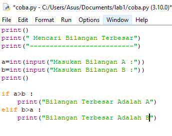
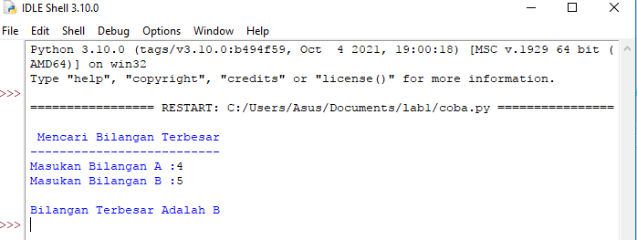
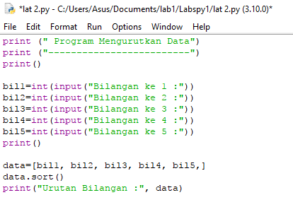
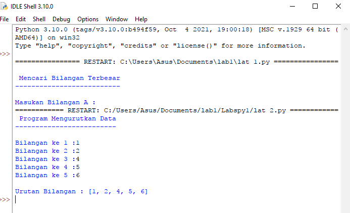
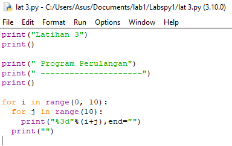
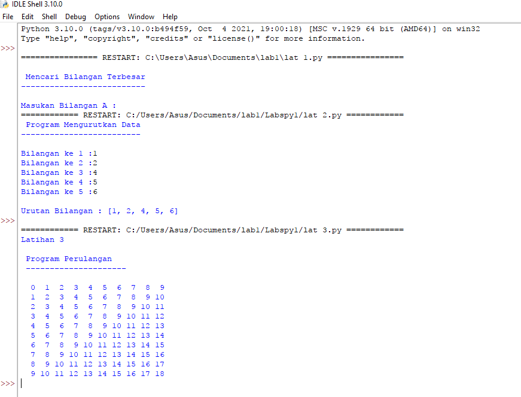
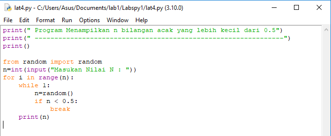
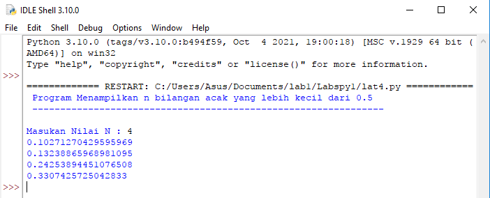

# Labspy1

## Latihan 1
-Program Mencari Bilangan Terbesar

Program

Hasil

## Latihan 2
-Program Mengurutkan Data

Program

Hasil

## Latihan 3
-Program Pengulangan Bertingkat

Program

Hasil

## Latihan 4
-Program Bilangan Acak Yang Lebih Kecil Dari 0.5

Program

Hasil

## SELESAI